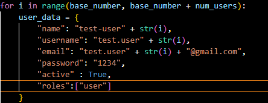
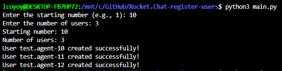
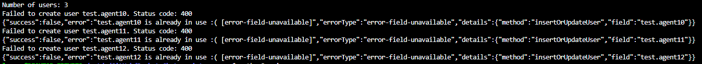
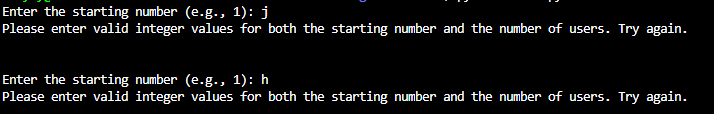

# Rocket.Chat-register-users
A basic way to register user using a script. The script runs in three simple steps:

1. run `main.py` file.

2. The file will ask you the starting number (e.g., 1) where the test users will be created (e.g., test.user-1). Later, it will ask you the amount/number of users to be created:

3. After this, it will create user according to these parameters (They can be edited if required):

Result will look like this:

If there's an error, the output will throw it and it will make it visible for the user:

